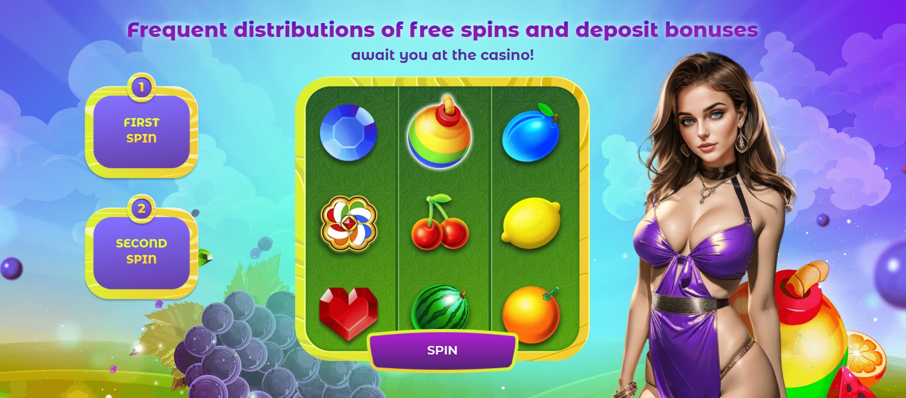

# Multi-lang-slots

It's an application built using React, HTML, CSS and JS, with automatic detection of the browser language and translation of the application into the required language (11 languages, English by default). It allows users to make a couple of spins and get a bonus to start playing the game.

### Installation

To install the application, follow these steps:

Clone the repository to your local machine.
Open a terminal and navigate to the root directory of the project.
Run npm install to install the dependencies.
Run npm start to start the development server.
Open http://localhost:3000 in your browser.
